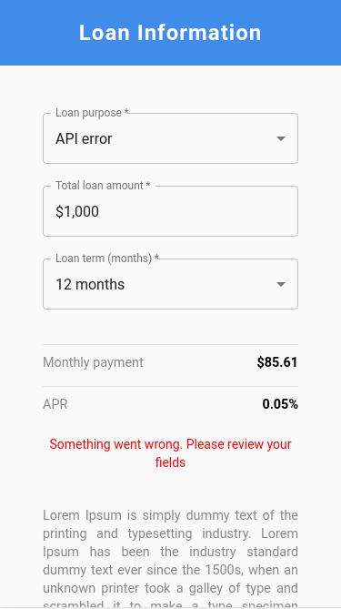

<h1 align="center">
    Loan Application
</h1>

<p align="center">
  <a href="https://www.linkedin.com/in/joaorpereira/">
    
  </a>

  

  <a href="https://www.typescriptlang.org/">
    
  </a>
  <a href="#">
    
  </a>
</p>

---

<p align="center">
 <a href="#-about">About</a> •
 <a href="#-technologies">Technologies</a> • 
 <a href="#-how-to-download-the-project">How to download the project</a> • 
 <a href="#-license">License</a>
</p>

---
### 🔖 About

**Loan Application** is a website developed to allow the user to submit their loan application. Also, after the user do their submition, he/she are able to see the available loan options in the application.

This project was done as a technical challenge to improve my skills as a **Frontend Developer** and learn to use **Typescript**, **React JS**, **React Testing Library** and **StoryBook**. Also it was a part of With Clutch company assignment process.

Their data is from Unplash API: https://clutch-interview-service.herokuapp.com/

---
#### 💻 FrontEnd



---
### 🛠 Technologies

The following technologies/tools were used:

- [Typescript](https://www.typescriptlang.org/);
- [ECS6+](http://www.ecma-international.org/ecma-262/6.0/);
- [ReactJs](https://reactjs.org/);
- [CSS3](https://developer.mozilla.org/en-US/docs/Web/CSS);
- [Material UI](https://mui.com/);
- [HTML5](https://developer.mozilla.org/en-US/docs/Web/HTML);
- [React Testing Library](https://testing-library.com/);
- [Jest](https://jestjs.io/);
- [Storybook](https://storybook.js.org/);

---
### 📎 How to download the project

##### 👉 Tools needed:
- [Vscode](https://code.visualstudio.com/) was used in this project; 
- [Node.Js](https://nodejs.org/en/) - Installed on your machine;
- [Git](https://git-scm.com/downloads) - Installed on your machine;

##### 👉 Install dependencies:

```bash

#->In the terminal:

# Clone repository:
$ git clone https://github.com/joaorpereira/loan-app.git

# Install dependencies:
$ yarn

# Start the project
$ yarn start

# After loading the project it will automatically open a tab in the default browser.

# To run the tests
$ yarn test

# To run the tests in watch mode
$ yarn test:watch

# To run storybook
$ yarn storybook

```
---
### 📜 License

This project is under the MIT license. See the [LICENSE](LICENSE) file for more details.
